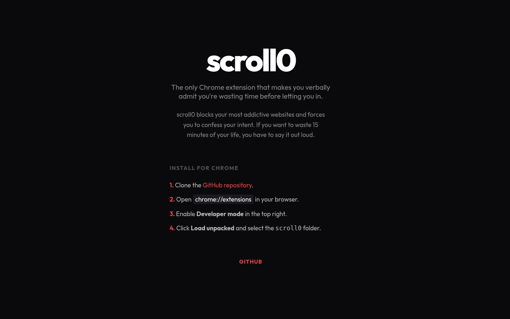
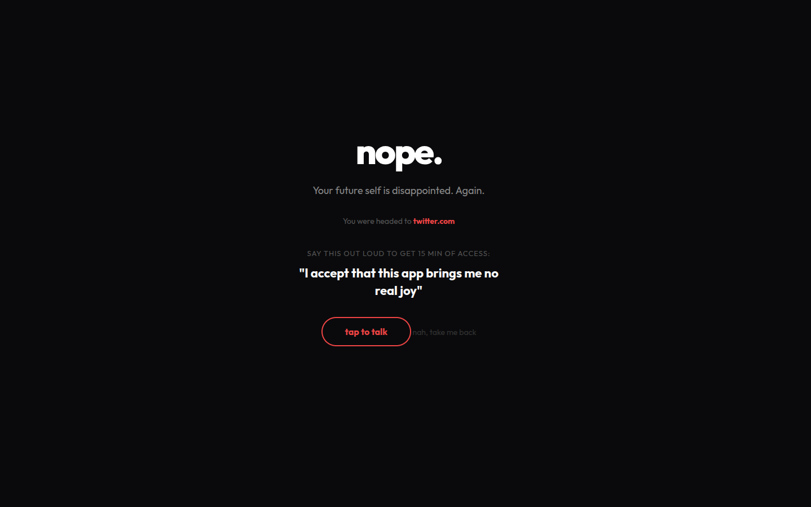

# scroll0

Stop doomscrolling by making it awkward.



`scroll0` is a Chrome extension that blocks your most addictive websites and forces you to verbally admit you're wasting time before granting access. No more mindless scrolling; if you want to waste 15 minutes, you have to say it out loud.



## Features

- **Voice-Activated Unlocking:** You must speak a specific phrase (e.g., "I am currently wasting my life") to unblock a site.
- **Timed Access:** Grants 15 minutes of access after successful validation, then locks it again.
- **Roast Mode:** Greets you with a healthy dose of reality when you try to visit blocked sites.

## Installation

Since this is a developer-focused tool, you'll need to load it manually:

1. **Clone the repository:**
   ```bash
   git clone https://github.com/mryan-3/scroll0.git
   cd scroll0
   ```

2. **Open Extensions Page:**
   Navigate to `chrome://extensions` in your Google Chrome browser.

3. **Enable Developer Mode:**
   Toggle the switch in the top right corner.

4. **Load Unpacked:**
   Click the **Load unpacked** button and select the `scroll0` folder you just cloned.

## Usage

1. Click the `scroll0` icon in your extensions toolbar.
2. Add the domains you want to block (e.g., `twitter.com`, `instagram.com`).
3. Try visiting one of those sites.
4. When prompted, click the "tap to talk" button and say the required phrase clearly.
5. If validated, you'll get 15 minutes of guilt-ridden browsing.

## License

MIT
